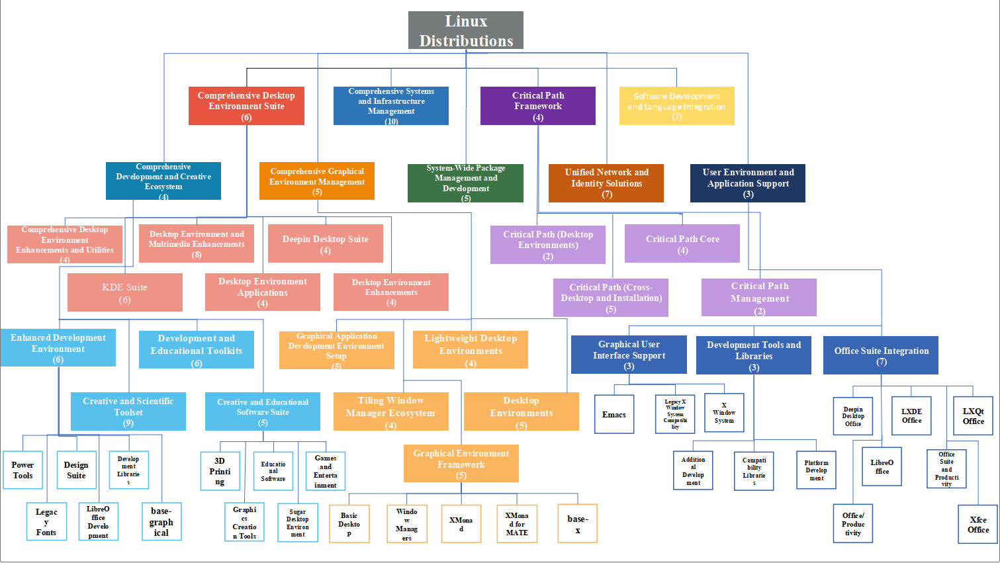

## Table of Contents

- Requirements
- Usage
- Visualization of Our Constructed Tree
- Content of official Tree

## Requirements
* python=3.9
* openai=1.3.3
* scikit-learn=1.5.2
* sentence-transformers=2.2.2
* torch=2.4.1
* tqdm=4.66.5
* transformers=4.38.1

## Usage

### Setup
* git clone https://github.com/jdm4pku/FTBuilder.git
* conda create -n FTBuilder python=3.9
* pip install openai
* pip install tqdm
* pip install scikit-learn
* pip install kneed
* pip install sentence-transformers

### Construct and evaluate Tree
* bash ./script/tree_construct.sh
* bash ./script/tree_eval.sh

### Artifact Recommendation with LLMs
* python src/llm_recommend.py
* python src/llm_recommend_official.py

**Note**: You should fill your API key of GPT-4 and Deepseek in the `llm_recommend.py` and `llm_recommend_official.py`!

## Visualization of Our Constructed Tree
[TreeFileLink](https://github.com/jdm4pku/FTBuilder/blob/main/assets/our_tree.pdf)

## Content of official Tree

The content of offical tree can be found in the [link](https://rpmfind.net/linux/RPM/Groups.html).

